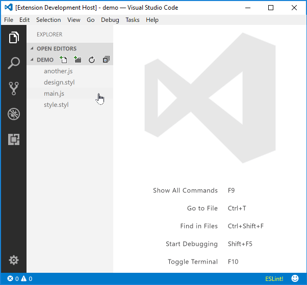

**Third Eye** is a Visual Studio Code extension that helps jumping through files effortlessly.

## Basic usage

Once the extension is installed, all supported file paths will be underlined, so you can open the file by pressing *Ctrl* key and click it.



Currently, the extension supports the following patterns:  
- **Go**
  ```go
  import (
    "fmt"
    "golang.org/x/net/context"
    "github.com/go-kit/kit/log"
    "my/local/project"
  )
  ```
- **JavaScript** and **JavaScript React**
  ```js
  import * as named from './file.js'
  import './file.js'
  require('./file.js')

  // This will open https://nodejs.org/api/fs.html in your browser and so does apply to all native Node.js APIs.
  var fs = require('fs')

  // In addition to `require`, any static file path in a function-call can be linked as well.
  var file = fs.readFileSync('./file.js', 'utf-8')
  var doSomething = function () {...}
  doSomething('./file.js')

  // This will open either its homepage, repository, or NPM page.
  // Clicking "Go > Go to Implementation" menu will bring you the actual code in your local "node_modules" directory.
  import something from 'thrid-party-npm-module'
  ```
- **Stylus**
  ```stylus
  @import './file.styl'
  @require './file.styl'
  ```
- **TypeScript** and **TypeScript React**
  ```typescript
  import * as named from './file.js'
  import './file.js'

  // This will open https://nodejs.org/api/fs.html in your browser and so does apply to all native Node.js APIs.
  import * as named from 'fs'

  // This will open either its homepage, repository, or NPM page.
  import something from 'thrid-party-npm-module'
  ```
